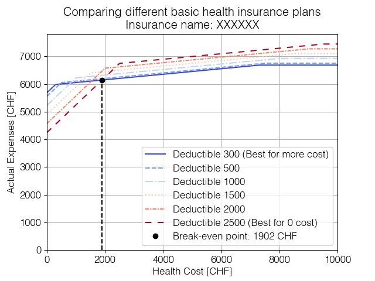

# Swiss Health Insurance Premium Comparator
_A comparator of different Swiss health insurance premium plans._



This project simulates and compares health insurance premium plans in Switzerland based on different deductible amounts. The tool plots actual health expenses vs. health costs to help users visualize and understand which insurance plan offers the best value for them.

## Features

- Compare different health insurance plans based on premium and deductible.
- Simulate actual costs depending on varying healthcare expenses.
- Includes both English and German versions of the plots.
- Identifies the best plan for low and high healthcare costs.
- Visualizes the break-even point where a higher deductible becomes more advantageous.

---

## How It Works

The tool compares Swiss health insurance plans by calculating and plotting actual expenses as a function of healthcare costs. It considers the following:

1. **Premiums** - The monthly insurance cost.
2. **Deductibles** - The amount paid out-of-pocket before the insurance coverage kicks in.
3. **Co-payment** - A 10% share of costs after reaching the deductible, up to a maximum of CHF 700.

The program simulates costs for various insurance plans, with customizable parameters for different insurance companies.

## Simulation Parameters

- **Co-payment rate**: 10% of costs above the deductible.
- **Co-payment maximum**: CHF 700.
- **Premiums and deductibles**: Can be customized for each insurance plan.
- **Cost range**: Simulated up to CHF 10,000 (default)

### Example Insurance Plans

- Swisscare HMIE
- Swisscare SPSS
- Visana (replaceable with other insurance plans)

## Installation

Clone the repository and install the required dependencies (Numpy and Matplotlib).

```bash
git clone https://github.com/yourusername/swisshealthcost.git
cd swisshealthcost
```

## Usage

Run the Python script to generate the comparison plots.
```bash
python main.py
```

## Customization

You can change the insurance company details, premium rates, and deductibles directly in the script to fit your needs. Update the variable `premiums`and `deductibles` with your specific data:

```bash
premiums = np.array((473.65,462.75,435.45,408.25,380.95,353.75))
deductibles = np.array((300,500,1000,1500,2000,2500))
```

## Output

The program will generate two plots:

1. **English version**: Shows the comparison of different insurance plans, with labels identifying the best plans for low and high healthcare costs.
2. **German version**: The same plot as above but in German.

Both plots are saved as .png files

## License

This project is licensed under the **GNU General Public License Version 3**. You may use, distribute, and modify this project under the terms of the GPLv3.

For more information, see the [LICENSE](LICENSE) file or visit [https://www.gnu.org/licenses/gpl-3.0.en.html](https://www.gnu.org/licenses/gpl-3.0.en.html).
